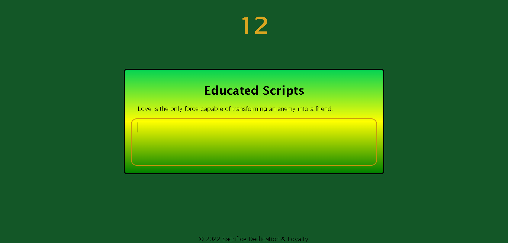

# Educated Scripts
## Resources 
[GitHubLink]https://github.com/MJ-Allen/educated-scripts

## Badges

## Description
Our task is to create a game for user to develop their skills at typing while being timed, the goal is for users to overtime become more comforable with the keys while at the same time increasing their speed and performance.  Fun, challenging game for user to compete with themselves.

## Table of Contents 

- [Visuals](#visuals
- [Usage](#usage)
- [Credits](#credits)

## Visuals

## Usage
AS A user looking for to enhance their typing skills
I WANT to create an application that allows user to type while having their time calcuated.
SO THAT I can track the users performance based on speed and levels completed.

## Credits
List your collaborators, I was fortunate enough to get additional assistance from class mates either during office hours or during private study group sessions after class. I truly appreciate any help that I have received throughout this project.

